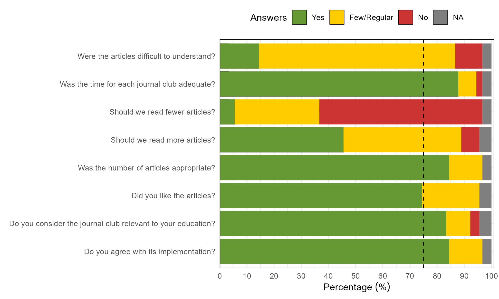
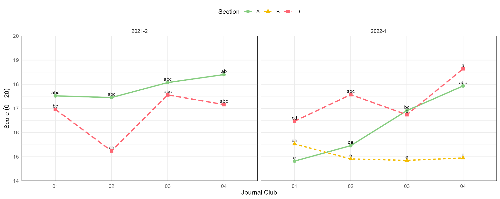

**Implementation of a journal club in a plant genetics lecture as a teaching-learning strategy during the COVID-19 pandemic**

Flavio Lozano-Isla^1\*^, Elizabeth Heros-Aguilar^1^, Andres Casas^2^

^1^ Universidad Nacional Agraria La Molina, Facultad de Agronomía, Departamento Académico de Fitotecnia, Lima, Perú.

^2^ Universidad Nacional Agraria La Molina, Facultad de Agronomía, Departamento Académico de Horticultura, Lima, Perú.

\*Corresponding author. Email: [flozano@lamolina.edu.pe](mailto:flozano@lamolina.edu.pe) 

ORCID IDs:

Flavio Lozano-Isla: ^^0000-0002-0714-669X


# 

```Unknown element type at this position: UNSUPPORTED```# Abstract

In the teaching-learning environment there are different tools to transmit information in an assertive way to students. In the areas of agricultural sciences, there are courses where the concepts are abstract, which generates disinterest in the participants due to their lack of association and practical application of what they are studying, limiting the critical sense of the students. Virtualization aggravated this during the COVID-19 pandemia. This paper presents the journal club methodology as a strategy to reinforce theoretical-practical knowledge through the reading of scientific articles in virtual environments. The methodology was applied in two academic semesters (i.e. 2021 to 2022) in the plant genetics lectures. The students read four articles per academic semester and performed a critical essay in a group. The results show that more than 90% of the participants agree with its implementation and that they liked the articles. Whereas, 80% of the students consider that it is relevant to their education. The application of the methodology helped students to integrate theoretical knowledge and understand complex concepts in the practical application of the topics covered in the lectures. Additionally, the students presented an increase in critical thinking and an improvement in essay writing.

**Keywords:** JC, agriculture, plant genetics, sci-hub, research tools, soft skills

# 

```Unknown element type at this position: UNSUPPORTED```# Introduction

The World Health Organization declared a pandemic on March 11, 2020, due to the SARS-CoV-2. This is supposed new challenge for students and faculties for the implementation of remote learning by universities worldwide. Platforms such as Zoom, Google Meet, and Microsoft Teams became the "new normal", and the primary venue for teaching and socializing.

A journal club (JC) is one of the well-established and popular methods of graduate and post-graduate education with about two hundred years of history (Topf et al., 2017). The JC was denominated in this way by Dr. James Paget in 1835. It was so named as the doctors of St. Bartholomew's Hospital, London, used to sit in a lounge and read the journals. But since their introduction by Sir William Osler in 1875 as regular meeting for a group of doctors and students to discuss publications where the JC have a long history in the medical sciences.

The original purpose of a JC was to help physicians stay up to date with current research and implement the research findings in clinical practice. It promotes group studying and contributes to developing a habit of continuously studying. But many aims can be achieved by participants during JC sessions as spreading scientific information and knowledge transfer, keeping up to date with the literature, and developing critical thinking or analytical skills in general. Additionally, the JC also acts as a motivating tool (Sanwatsarkar et al., 2022) and it makes the task of studying more manageable.

This paper describes the establishment of Journal Clubs during two academic semesters for plant genetics lectures. The JC was carried out under remote learning at the Universidad Nacional Agraria La Molina, Peru. The main hypothesis is that the implementation of JC will improve the critical thinking skills and the capability of the student to relate the topic of the lectures in an environment with a lack of practical knowledge due to COVID restrictions.

# Materials y Methods

## Sample and participants

The methodology was applied to students from the fifth to sixth academic semesters of the plant genetics course at the Universidad Nacional Agraria La Molina. The information was collected during one year (i.e. two academic semesters). In the academic semester, 2021-2 and 2022-1 a total of 90 students were divided into 5 sections. Each academic semester lasted 16 weeks.

## Journal club and application

The journal club methodology is divided into four stages. The training stage is given only once per academic semester to all students. The following three steps (i.e. reading, writing, and discussion) are repeated for each article with a duration per session of 60 minutes ([Figure  @fig:id.xmml0bkjl3j]:). Although the presentation language was announced to be Spanish, all the papers were in English (**Table S1**).


{#fig:id.xmml0bkjl3j}

**Research tools:** Students learn various tools that will enable the appropriate use of software and applications for reading articles and writing essays. Among the tools were Zotero in the desktop version as the web connector, google documents, hypothes.is and the use of web translators (i.e. google Translate, DeepL, and DocTranslator). The induction stage has a duration of 120 minutes.

**Reading articles:** Students are assigned into random groups of three to four. The reading is presented and they have 30 minutes to read and extract the essential information from the article. At the end of the reading time, the professor projects the article and asks questions about the topic of the reading or the hypothesis of the work. Then they read the document and mention the main points in the article.

**Essay writing:** For the first 30 minutes the students in groups start the organization for the writing of the reading essay. In the remaining time, the professor gives indications on how to improve the writing or develops feedback on the mistakes made in the previous JC (**Supplementary Information 2**).

**Reading discussion:** Students are separated into random groups to exchange ideas and opinions from the reading. At the end of that time, the discussion begins with the free participation of the students. In case there are no initial opinions, the professor will ask questions and question the reading to encourage discussion by presenting different ideas and opinions. The professor can optionally include an explanation with the use of slides to present a case or experience with the topic covered in the reading. 

## Results evaluation

**Survey design:** A survey was developed to determine the tools that participants learned to use during the course. In addition, objective questions were included to determine the level of satisfaction with the methodology.


| **Number**                                                   | **Question**                                                  |
|--------------------------------------------------------------|---------------------------------------------------------------|
| 1                                                            | Were the articles difficult to understand?                    |
| 2                                                            | Was the time for each journal club adequate?                  |
| 3                                                            | Should we read fewer articles?                                |
| 4                                                            | Should we read more articles?                                 |
| 5                                                            | Was the number of articles appropriate?                       |
| 7                                                            | Did you like the articles?                                    |
| 8                                                            | Do you consider the journal club relevant to your education?  |
| 9                                                            | Do you agree with its implementation?                         |


: List of questions of the survey conducted to evaluate the level of satisfaction of the Journal Club of the students of the Universidad Nacional Agraria La Molina in the lecture on plant genetics during the period 2021-2 and 2022-1. {#tbl:id.j5db8cq6z9mt}

**Essay evaluation:** The product of each JC was the submission of an essay and it was evaluated at the end of each cycle (i.e. week three). Grading was based on the use of an objective rubric (**Table S2**). The grading system was from 0 to 20. Where 20 is the maximum passing grade.

**Data analysis**

Data analysis was performed in the statistical software R version 4.2.1 ([R Core Team, 2020](https://www.zotero.org/google-docs/?U07ghK)). The scores were analyzed in a linear model taking into account the interaction of the number of journal clubs, the section, and the year of application of the methodology. The results were subjected to an analysis of variance to analyze the interaction between the factors. The SNK (Student-Newman-Keuls) test in the agricolae package ([Mendiburu, 2021](https://www.zotero.org/google-docs/?d0NZEZ)) was used to compare the means of the grades. The graphs were made with the inti package ([Lozano-Isla, 2022](https://www.zotero.org/google-docs/?gA9JQi)). Qualitative data analysis and graphs were analyzed by the frequency of occurrence of terms with the wordcloud package ([Fellows, 2018](https://www.zotero.org/google-docs/?dIS9C8)). 

# 

```Unknown element type at this position: UNSUPPORTED```# Results

## Student perception

To determine the perception of the methodology, a survey was applied at the end of the semester to determine the use of learned tools and the application of the journal club. 

The 84.4% of students agree with the JC implementation and 83.3% consider it relevant for its education. Regarding the article read, 74.4% liked the articles chosen, whereas 84.4% consider the number of articles adequate for the duration of the course. Additionally, 60% considered not reducing the number of articles and 45% considered that should increase the number of articles. According to 87.8% of students consider timelapse for each JC is adequate. Regards to the difficulty of the articles, 14% considered them difficult to understand; whereas 72.2% of students considered the article medium-difficult ([Figure  @fig:id.pmcc7d4jkx1a]:).

{#fig:id.pmcc7d4jkx1a}

## Tools implemented

A survey was performed to determine the tools that the student used to read the articles and write the essays for the JC. The frequency of the names of the tools was recorded and counted to determine their use.

The frequency of the tools was divided into 5 groups represented by the colors: forest-green, blue, orange, purple, and gray ([Figure  @fig:id.6pfwogtac6re]:). The first group is represented by Google docs, Google Scholar, and Zotero with 11.9%, 10.7%, and 10.3% respectively. The second group was presented by Sci-Hub and iLovePDF with 9.3% and 9.1% respectively. The third group by onlinedoctranslator with 5.6%. The fourth group is DeepL, Scimago Journal & Country Rank, and Foxit reader with 4.2%, 3.8%, and 3.0% respectively. Tools such as Hypothesis, Articul8, and Grammarly represented less than 3% each.


{#fig:id.6pfwogtac6re}

## Results assessment 

The writing of an essay by groups was the product of each Journal Club. The result of each essay was evaluated and compared by section during the two academic semesters in the plant genetic lectures.

Sections A and D presented an increase  in the score  in time for the evaluation of the essays. In the semester 2021-2 group A started with a score of 17.52 and at the final get a score of 18.4, whereas group D had 16.96 and 17.16 respectively for the same evaluations. In the semester 2022-1 group A started with 14.82 and concluded with a score of 17.93, whereas group D had a score of 16.47 and 18.64 respectively for the same evaluations. For both sections, A and D presented a continue improve in the score over time during the two academic semesters  ([Figure  @fig:id.y18qqmtszisb]:). Section D presented a reduction in the score in 2021-1 for JC two and four and JC three in 2022-1 ([Figure  @fig:id.y18qqmtszisb]:). Its reduction was associated with the fact of the type of the articles (i.e research articles, **Table S1**).   

Section B in the semester 2022-1 did not present an improvement in the score during the timelapse of journal clubs. The initial score for this group was 15.53 and finished with a score of 14.95 ([Figure  @fig:id.y18qqmtszisb]:).

{#fig:id.y18qqmtszisb}

# 

```Unknown element type at this position: UNSUPPORTED```# Discussion 

With the advent of the COVID-19 pandemic in 2020, there was a huge change in the development of lectures in the university worldwide  [(Ozkara et al., 2022)](https://www.zotero.org/google-docs/?7Cl73K). The synchronous online lectures become the main environment from which students interacted taking importance to implement alternative teaching-learning strategies because of the physical distancing. In the present work, we analyze the implementation of a synchronous online journal club in plant genetics lectures during two-semester academics at Universidad Nacional Agraria La Molina, Peru. 

For a long time, JC was used in medical areas [(Aweid et al., 2022; Ozkara et al., 2022)](https://www.zotero.org/google-docs/?QTo4J5) and in post-graduate education [(Taverna et al., 2022)](https://www.zotero.org/google-docs/?oLMYbU) where was found to be educationally valuable, aiding the development of critique skills, promoting research awareness, professional empowerment, generating a positive research culture and evidence-based practice [(Xiong et al., 2018)](https://www.zotero.org/google-docs/?9HbCa7). Our results showed that 83.3% of the participants found the JC sessions rich, productive and relevant to their formal education and they agree with its implementation.

The JC implementation received excellent feedback from participants. Meetings lasted approximately 1 hour on average by week. An improvement in student interaction was achieved since the activities were in groups and open discussions with all the participants. Additionally, the students showed an enhancement in academic reading abilities. Nevertheless, one of the main weaknesses of graduate students is critical thinking and scientific writing. This fact has been evidenced by the reduction in the scores when the students were exposed to reading and discussing research articles. However, in the two evaluated semesters, there was an increase in the score of four of the five groups with an improvement in writing skills. Similar results were found by other authors during the journal club sessions to think more critically [(Taverna et al., 2022)](https://www.zotero.org/google-docs/?Qg4xtQ).

In agricultural sciences lectures, field activities are an important component in the education of the students. Since the closure of university campuses due to COVID-19 and the quick transition to online courses, students were isolated from universities with a negative impact on their education [(Ozkara et al., 2022)](https://www.zotero.org/google-docs/?XdIYMA). The JC is presented as a relevant alternative used during online learning platforms to promote the discussion and participation of students to strengthen the knowledge acquired in the theoretical lectures. Even under the Post-COVID pandemic, the implementation of JC could be productive as most universities partial will continue with a hybrid model for online teaching-learning as they provide a flexible and feasible platform for evidence-based learning [(Ozkara et al., 2022)](https://www.zotero.org/google-docs/?omceoP). 

An additional advantage of the implementation of a JC is the reduction of plagiarism as we avoid the repetition of the reading each semester and through the years and complement the readings with the lectures. In most cases, the students benefit from the state of the art used in the studied area of lectures and associate the theoretical knowledge acquired by the students. The present implementation during the plat genetic lecture could help to strengthen soft skills in the students such as critical thinking, teamwork, constant and independent learning, tolerance to different opinions, and digital skills. 

# Conclusion

The implementation of a journal club in plant science lectures has presented an alternative that helps to reduce the negative impact of the pandemic on education and created a venue for academic discussions under the lack of field practice.  The participants perceive the journal club as relevant to their formal education and they agree with its implementation. Additionally, the JC allows students to complement the theoretical knowledge and the development of soft skills which is an indispensable prerequisite of lifelong learning and important for future employability.


# 

```Unknown element type at this position: UNSUPPORTED```# References

[Aweid, B., Haider, Z., Wehbe, M., & Hunter, A. (2022). Educational benefits of the online journal club: A systematic review. *Medical Teacher*, *44*(1), 57–62. https://doi.org/10.1080/0142159X.2021.1963424](https://www.zotero.org/google-docs/?h1YWHz)

[Fellows, I. (2018). *wordcloud: Word Clouds* (2.6). https://CRAN.R-project.org/package=wordcloud](https://www.zotero.org/google-docs/?h1YWHz)

[Lozano-Isla, F. (2022). *inti: Tools and Statistical Procedures in Plant Science* (0.5.7). https://CRAN.R-project.org/package=inti](https://www.zotero.org/google-docs/?h1YWHz)

[Mendiburu, F. de. (2021). *agricolae: Statistical Procedures for Agricultural Research* (1.3-5). https://CRAN.R-project.org/package=agricolae](https://www.zotero.org/google-docs/?h1YWHz)

[Ozkara, B. B., Karabacak, M., & Alpaydin, D. D. (2022). Student-Run Online Journal Club Initiative During a Time of Crisis: Survey Study. *JMIR Medical Education*, *8*(1), e33612. https://doi.org/10.2196/33612](https://www.zotero.org/google-docs/?h1YWHz)

[R Core Team. (2020). *R: A language and environment for statistical computing* [Manual]. https://www.R-project.org/](https://www.zotero.org/google-docs/?h1YWHz)

[Taverna, M., Bucher, J. N., Weniger, M., Gropp, R., Lee, S. M. L., Mayer, B., Werner, J., & Bazhin, A. V. (2022). Perception of journal club seminars by medical doctoral students: Results from five years of evaluation. *GMS Journal for Medical Education*, *39*(1), Doc4. https://doi.org/10.3205/zma001525](https://www.zotero.org/google-docs/?h1YWHz)

[Xiong, L., Giese, A.-K., Pasi, M., Charidimou, A., van Veluw, S., & Viswanathan, A. (2018). How to Organize a Journal Club for Fellows and Residents. *Stroke*, *49*(9), e283–e285. https://doi.org/10.1161/STROKEAHA.118.021728](https://www.zotero.org/google-docs/?h1YWHz)


# Ethics Considerations

Informed consent was obtained from all participants.


#| END

```Unknown element type at this position: UNSUPPORTED```# Supplementary information


| **Journal**                                                                                                               | Comunicar                                                                                                                  |
|---------------------------------------------------------------------------------------------------------------------------|----------------------------------------------------------------------------------------------------------------------------|
| **Title**                                                                                                                 | Implementation of a journal club in a plant genetics lecture as a teaching-learning strategy during the COVID-19 pandemic  |
| **Authors**                                                                                                               | Flavio Lozano-Isla, Elizabeth Heros-Aguilar, Andres Casas                                                                  |


```Unknown element type at this position: UNSUPPORTED```**Supplementary Table 1**

**Table S1**: Reading list for the Journal Club implemented during 2021-2022 in the Universidad Nacional Agraria La Molina, Peru in the course of plant genetics.


| **JC**                                                                                                                                                                                            | **Semester**                                                                                                                                                                                      | **Title**                                                                                                                                                                                         | **Year**                                                                                                                                                                                          | **Journal**                                                                                                                                                                                       | **Type**                                                                                                                                                                                           |
|---------------------------------------------------------------------------------------------------------------------------------------------------------------------------------------------------|---------------------------------------------------------------------------------------------------------------------------------------------------------------------------------------------------|---------------------------------------------------------------------------------------------------------------------------------------------------------------------------------------------------|---------------------------------------------------------------------------------------------------------------------------------------------------------------------------------------------------|---------------------------------------------------------------------------------------------------------------------------------------------------------------------------------------------------|----------------------------------------------------------------------------------------------------------------------------------------------------------------------------------------------------|
| 1                                                                                                                                                                                                 | 2021-2                                                                                                                                                                                            | [Breeding crops to feed 10 billion](https://www.nature.com/articles/s41587-019-0152-9)                                                                                                            | 2019                                                                                                                                                                                              | nature biotechnology                                                                                                                                                                              | review article                                                                                                                                                                                     |
| 2                                                                                                                                                                                                 | 2021-2                                                                                                                                                                                            | [Imaged-based phenotyping accelerated QTL mapping and qtl × environment interaction analysis of testa colour in peanut (Arachis hypogaea)](https://onlinelibrary.wiley.com/doi/10.1111/pbr.12905) | 2021                                                                                                                                                                                              | plant breeding                                                                                                                                                                                    | research article                                                                                                                                                                                   |
| 3                                                                                                                                                                                                 | 2021-2                                                                                                                                                                                            | [Genetic patterns offer clues to evolution of homosexuality](https://www.nature.com/articles/d41586-021-02312-0)                                                                                  | 2021                                                                                                                                                                                              | nature                                                                                                                                                                                            | news                                                                                                                                                                                               |
| 4                                                                                                                                                                                                 | 2021-2                                                                                                                                                                                            | [Heritability in Morphological Robot Evolution](https://doi.org/10.48550/arXiv.2110.11187)                                                                                                        | 2021                                                                                                                                                                                              | arxiv                                                                                                                                                                                             | research article                                                                                                                                                                                   |
| 1                                                                                                                                                                                                 | 2022-1                                                                                                                                                                                            | [Genome-edited crops for improved food security of smallholder farmers](https://www.nature.com/articles/s41588-022-01046-7)                                                                       | 2022                                                                                                                                                                                              | nature genetics                                                                                                                                                                                   | review article                                                                                                                                                                                     |
| 2                                                                                                                                                                                                 | 2022-1                                                                                                                                                                                            | [Crucial factors for the feasibility of commercial hybrid breeding in food crops](https://www.nature.com/articles/s41477-022-01142-w#Tab1)                                                        | 2022                                                                                                                                                                                              | nature plants                                                                                                                                                                                     | review article                                                                                                                                                                                     |
| 3                                                                                                                                                                                                 | 2022-1                                                                                                                                                                                            | [Semiautomated Feature Extraction from RGB Images for Sorghum Panicle Architecture GWAS](https://academic.oup.com/plphys/article/179/1/24/6116437)                                                | 2019                                                                                                                                                                                              | plant physiology                                                                                                                                                                                  | research article                                                                                                                                                                                   |
| 4                                                                                                                                                                                                 | 2022-1                                                                                                                                                                                            | [A chromosome predisposed for sex](https://www.nature.com/articles/d41586-022-01129-9)                                                                                                            | 2022                                                                                                                                                                                              | nature                                                                                                                                                                                            | news                                                                                                                                                                                               |


**Supplementary Table 2**

**Table S2:** Essay evaluation rubric for the journal club implemented in the plant genetics course.


| **Criterios**                                                                                                                                                                                                                                                                                                                          | **Puntaje**                                                                                                                                                                                                                                                                                                                            | **Ausente**                                                                                                                                                                                                                                                                                                                            | **Regular**                                                                                                                                                                                                                                                                                                                            | **Bueno**                                                                                                                                                                                                                                                                                                                              | **Excelente**                                                                                                                                                                                                                                                                                                                          | **Descripción**                                                                                                                                                                                                                                                                                                                         |
|----------------------------------------------------------------------------------------------------------------------------------------------------------------------------------------------------------------------------------------------------------------------------------------------------------------------------------------|----------------------------------------------------------------------------------------------------------------------------------------------------------------------------------------------------------------------------------------------------------------------------------------------------------------------------------------|----------------------------------------------------------------------------------------------------------------------------------------------------------------------------------------------------------------------------------------------------------------------------------------------------------------------------------------|----------------------------------------------------------------------------------------------------------------------------------------------------------------------------------------------------------------------------------------------------------------------------------------------------------------------------------------|----------------------------------------------------------------------------------------------------------------------------------------------------------------------------------------------------------------------------------------------------------------------------------------------------------------------------------------|----------------------------------------------------------------------------------------------------------------------------------------------------------------------------------------------------------------------------------------------------------------------------------------------------------------------------------------|-----------------------------------------------------------------------------------------------------------------------------------------------------------------------------------------------------------------------------------------------------------------------------------------------------------------------------------------|
| **Puntualidad**                                                                                                                                                                                                                                                                                                                        | 0.0                                                                                                                                                                                                                                                                                                                                    | -5.0                                                                                                                                                                                                                                                                                                                                   |                                                                                                                                                                                                                                                                                                                                        |                                                                                                                                                                                                                                                                                                                                        | 0.0                                                                                                                                                                                                                                                                                                                                    | - Entrega de trabajos dentro del plazo asignado.                                                                                                                                                                                                                                                                                        |
| **Introducción**                                                                                                                                                                                                                                                                                                                       | 3.0                                                                                                                                                                                                                                                                                                                                    | 0.0                                                                                                                                                                                                                                                                                                                                    | 1.0                                                                                                                                                                                                                                                                                                                                    | 2.0                                                                                                                                                                                                                                                                                                                                    | 3.0                                                                                                                                                                                                                                                                                                                                    | - Introducción con los objetivos y/o hipótesis de la lectura (máximo 300 palabras).- Texto escrito en un solo párrafo, separando los temas por punto seguido.                                                                                                                                                                           |
| **Resumen**                                                                                                                                                                                                                                                                                                                            | 4.0                                                                                                                                                                                                                                                                                                                                    | 1.0                                                                                                                                                                                                                                                                                                                                    | 2.0                                                                                                                                                                                                                                                                                                                                    | 3.0                                                                                                                                                                                                                                                                                                                                    | 4.0                                                                                                                                                                                                                                                                                                                                    | - Resumen con los puntos más importantes señalados en el artículo.                                                                                                                                                                                                                                                                      |
| **Discusiones**                                                                                                                                                                                                                                                                                                                        | 4.0                                                                                                                                                                                                                                                                                                                                    | 1.0                                                                                                                                                                                                                                                                                                                                    | 2.0                                                                                                                                                                                                                                                                                                                                    | 3.0                                                                                                                                                                                                                                                                                                                                    | 4.0                                                                                                                                                                                                                                                                                                                                    | - Crítica de la lectura, relacionándolo con los saberes previos, opiniones y temas tratados en clases.- Incluir como mínimo una cita por cada integrante.                                                                                                                                                                               |
| **Conclusiones**                                                                                                                                                                                                                                                                                                                       | 3.0                                                                                                                                                                                                                                                                                                                                    | 0.0                                                                                                                                                                                                                                                                                                                                    | 1.0                                                                                                                                                                                                                                                                                                                                    | 2.0                                                                                                                                                                                                                                                                                                                                    | 3.0                                                                                                                                                                                                                                                                                                                                    | - Escribir como texto corrido separadas por punto seguido respondiendo los objetivos (máximo 300 palabras).                                                                                                                                                                                                                             |
| **Referencias**                                                                                                                                                                                                                                                                                                                        | 2.0                                                                                                                                                                                                                                                                                                                                    | 0.0                                                                                                                                                                                                                                                                                                                                    | 1.0                                                                                                                                                                                                                                                                                                                                    | 1.5                                                                                                                                                                                                                                                                                                                                    | 2.0                                                                                                                                                                                                                                                                                                                                    | - Se recomienda usar Zotero para el manejo de referencias.- La referencias deben estar completas: autor, título y año.- NO colocar las citas y referencias toda escrita en mayúsculas.                                                                                                                                                  |
| **Formato**                                                                                                                                                                                                                                                                                                                            | 4.0                                                                                                                                                                                                                                                                                                                                    | 1.0                                                                                                                                                                                                                                                                                                                                    | 2.0                                                                                                                                                                                                                                                                                                                                    | 3.0                                                                                                                                                                                                                                                                                                                                    | 4.0                                                                                                                                                                                                                                                                                                                                    | > Formato:- Usar el formato del American Psychological Association (APA).- Fuente: Times New Roman- Tamaño: 12- Interlineado: 1.15- Texto: justificado- Páginas: máximo 4 páginas numeradas> Recomendaciones:- NO usar viñetas en el documento.- Uso correcto de la gramática: nombres científicos, mayúsculas y signos de puntuación.  |


