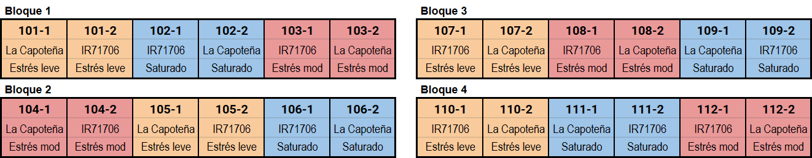
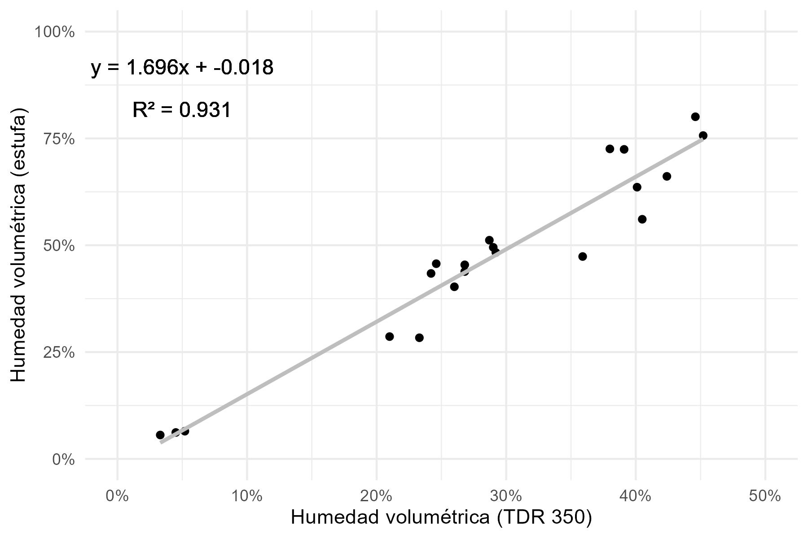

# PROBLEMA DE INVESTIGACIÓN

El arroz es la principal fuente de calorías de más de la mitad de la población a nivel mundial, sin embargo es uno de los cultivos con mayor consumo de agua [(Avil Kumar & Rajitha, 2019; Carrijo et al., 2017)](https://www.zotero.org/google-docs/?9eLjpc). Métodos para incrementar la eficiencia en el uso de agua no han sido adoptados en el cultivo por las pérdidas potenciales de rendimiento [(Carrijo et al., 2017)](https://www.zotero.org/google-docs/?lLkimV). Debido a los problemas mencionados, se desea encontrar variedades que sean capaces de mantener altos rendimientos a la cosecha tolerando periodos de sequía y reduciendo el consumo de agua.

# OBJETIVOS

## Objetivo General

Analizar la influencia de periodos de estrés hídrico en el comportamiento de dos cultivares de arroz.

## Objetivos Específicos

1. 	Evaluar la variación de los parámetros agronómicos y fisiológicos en los tratamientos de estrés hídrico leve y moderado en comparación al tratamiento saturado en los cultivares La Capoteña e IR-71706.

2. 	Cuantificar el consumo y la eficiencia de uso del agua por cada uno de los tratamientos.

# JUSTIFICACIÓN

La seguridad alimentaria de más de la mitad de la población mundial depende de la capacidad del mundo de producir y distribuir arroz [(Bandumula, 2018; Furuya & Koyama, 2005)](https://www.zotero.org/google-docs/?qGDoLg). Sin embargo, se estima que alrededor del 51% del cultivo y producción de arroz se reducirá en el próximo siglo debido al impacto de factores abióticos como las precipitaciones, sequía, inundación, temperatura y radiación solar en las diferentes etapas de crecimiento [(Hussain et al., 2020)](https://www.zotero.org/google-docs/?rtfctm). Las condiciones climáticas están cambiando abruptamente sin seguir patrón alguno, lo que sugiere que una variedad de arroz para el futuro debe ser capaz de soportar diferentes tipos de estreses bióticos y abióticos con un alto potencial de rendimiento [(Jena et al., 2023)](https://www.zotero.org/google-docs/?VI3GuU).

# REVISIÓN DE LITERATURA

## Importancia del arroz

El arroz (*Oryza sativa* L.) es uno de los cultivos básicos y es el cultivo alimenticio más importante del mundo [(Jena et al., 2023; Zeigler & Barclay, 2008)](https://www.zotero.org/google-docs/?L5bwQP), habiendo tenido un rol central en la cultura y nutrición humana durante los últimos 10,000 años [(Wei & Huang, 2019)](https://www.zotero.org/google-docs/?pZkAtM). El arroz siempre ha sido relevante para la seguridad alimentaria [(Bandumula, 2018)](https://www.zotero.org/google-docs/?IsSjMH) y la estabilidad socioeconómica, por lo que la investigación en este cultivo es fundamental para el desarrollo de tecnologías que permitan un aumento en la productividad en países en vías de desarrollo de Asia, América Latina y últimamente África [(Zeigler & Barclay, 2008)](https://www.zotero.org/google-docs/?jTfFui).

## Taxonomía

El arroz es una planta monocotiledónea que pertenece a la familia Poaceae, comúnmente conocidas como gramíneas. La clasificación taxonómica del arroz se muestra a continuación [(Clark et al., 1995; Soreng et al., 2015)](https://www.zotero.org/google-docs/?paw4T9).

| Reino: Plantae                        |
|---------------------------------------|
|   Orden: Poales                       |
|     Familia: Poaceae (= Graminae)     |
|       Tribu: Oryzeae                  |
|         Género: Oryza                 |
|           Especie: *Oryza sativa* L.  |

## Morfología

### Órganos vegetativos

El arroz constantemente produce macollos y hojas como parte de su crecimiento vegetativo [(Vergara, 1991)](https://www.zotero.org/google-docs/?gp4kgh). Los macollos son ramificaciones que se desarrollan de las axilas de las hojas en cada uno de los nudos no elongados del tallo central o de otros macollos [(S. Yoshida, 1981)](https://www.zotero.org/google-docs/?qXct5l).

La hoja del arroz está compuesta por la vaina y la lámina. En su intersección existe un par de aurículas y una lígula. La vaina es una elongación de la hoja enrollada en forma cilíndrica que cubre las nuevas hojas en desarrollo [(Smith & Dilday, 2002)](https://www.zotero.org/google-docs/?7ITEKT). La lámina de la hoja es alargada y lanceolada, es el principal órgano de fotosíntesis y transpiración [(Smith & Dilday, 2002)](https://www.zotero.org/google-docs/?XH5b67). La hoja bandera es la última hoja en emerger del tallo, y cuando la panícula emerge de la vaina, la hoja bandera se encuentra casi paralelo al eje de la panícula [(Smith & Dilday, 2002)](https://www.zotero.org/google-docs/?fNQTuh).

### Órganos reproductivos

La panícula está compuesta por el cuello (base), el raquis (eje), las ramas primarias y secundarias, los pedicelos, las glumas rudimentarias y las espiguillas [(Smith & Dilday, 2002; S. Yoshida, 1981)](https://www.zotero.org/google-docs/?ftnGx8). El raquis central usualmente mide entre 12 y 15 cm a la antesis, con 8 a 10 nudos [(Smith & Dilday, 2002)](https://www.zotero.org/google-docs/?3TlOCY). Usualmente sólo una rama principal sale de la base de la panícula, pero bajo condiciones favorables, como clima soleado o suelos fértiles, pueden emerger dos o tres ramas principales [(S. Yoshida, 1981)](https://www.zotero.org/google-docs/?Ac92aa).

La espiguilla es la unidad principal de la inflorescencia del arroz, compuesta por glumas (órganos similares a brácteas) y floretes. El florete incluye la lemma y palea (otros órganos similares a brácteas), lodículos (equivalentes a pétalos), estambres y un carpelo [(H. Yoshida & Nagato, 2011)](https://www.zotero.org/google-docs/?8Wdan8). Las flores del arroz son perfectas, compuestas de 6 estambres y un pistilo. Además, los dos lodículos en la base de pistilo proveen un mecanismo de apertura floral a la hidratación, lo cual causa la separación de la lemma y la palea [(Smith & Dilday, 2002)](https://www.zotero.org/google-docs/?NENiwt).

### Granos

El grano de arroz está compuesto por la cáscara y la cariópside. La cáscara consiste en lemma y palea, donde la lemma cubre dos tercios de la semilla y los extremos de la palea encajan perfectamente para cubrir completamente la semilla [(Smith & Dilday, 2002)](https://www.zotero.org/google-docs/?rDbaMP). La cariópside contiene el embrión y el endosperma almidonoso, cubierto por el tegumento y el pericarpo. Cuando la cariópside no está pulida se conoce como arroz marrón [(Smith & Dilday, 2002)](https://www.zotero.org/google-docs/?uRIN5U).

## Fenología

### Fase vegetativa

La fase vegetativa inicia con la germinación de la semilla y termina con la iniciación de la panícula. La duración de la fase puede ser de 25 a 90 días, y se atribuye principalmente a las diferencias de los cultivares [(Smith & Dilday, 2002)](https://www.zotero.org/google-docs/?hJYkxq). Las diferencias en el tiempo de crecimiento total del arroz se deben principalmente a diferencias en la duración de la fase vegetativa, por lo que las variedades precoces tienen periodos vegetativos cortos [(S. Yoshida, 1981)](https://www.zotero.org/google-docs/?iEnOsY). El arroz se siembra directamente en suelo seco, húmedo, o en camas húmedas para ser luego trasplantado 20 a 70 días después [(Vergara, 1991)](https://www.zotero.org/google-docs/?a50Cse). Los cambios más visibles de la fase vegetativa son la producción de macollos y hojas. En el trópico, el número máximo de macollos se logra entre los 40 y 60 días después del trasplante, dependiendo del cultivar, espaciamiento y fertilidad [(Vergara, 1991)](https://www.zotero.org/google-docs/?8304qi).

### Fase reproductiva

La floración del arroz involucra varios procesos: la iniciación de la inflorescencia o panícula, el desarrollo de las estructuras florales, la emergencia de la panícula y la apertura floral (antesis) [(H. Yoshida & Nagato, 2011)](https://www.zotero.org/google-docs/?ibyboi). La fase reproductiva empieza con la iniciación de la panícula o también conocido como el punto de algodón [(Caldas & Lizárraga, 2020)](https://www.zotero.org/google-docs/?Fso0RV), se caracteriza por cambios en las características vegetativas de crecimiento y la diferenciación de la panícula [(Smith & Dilday, 2002)](https://www.zotero.org/google-docs/?WYNcM1). Esta fase puede iniciar antes, al mismo tiempo, o después de que se haya alcanzado el número máximo de macollos [(Vergara, 1991)](https://www.zotero.org/google-docs/?DtMbQa). La duración de la fase reproductiva más el periodo de maduración puede ser considerada similar para cualquier variedad bajo las mismas condiciones [(S. Yoshida, 1981)](https://www.zotero.org/google-docs/?HrfVC3).

La iniciación de la panícula se considera a partir de la primera diferenciación microscópica del primordio, y esto ocurre alrededor de 30 días antes de la emergencia en la mayoría de cultivares de maduración intermedia [(Smith & Dilday, 2002)](https://www.zotero.org/google-docs/?99yGzb). La hoja bandera emerge alrededor de 18 días antes de la emergencia, y desde ese momento la panícula crece rápidamente y se mueve hacia arriba dentro de la vaina de la hoja bandera. Alrededor de 6 días antes de la emergencia, la vaina de la hoja bandera se ensancha, indicando la presencia de la panícula [(S. Yoshida, 1981)](https://www.zotero.org/google-docs/?MMxW3D). La emergencia de la panícula suele completarse dentro de 24 horas, y la antesis ocurre un día después de la emergencia de la panícula, iniciando normalmente desde la parte superior [(Vergara, 1991)](https://www.zotero.org/google-docs/?2Wootk). El arroz normalmente se auto poliniza [(Vergara, 1991)](https://www.zotero.org/google-docs/?qzkgLb), teniendo un mínimo porcentaje de polinización cruzada debido a que el polen solo es viable por 10 minutos desde la dehiscencia [(Smith & Dilday, 2002)](https://www.zotero.org/google-docs/?OPec51).

### Fase de maduración

La fase de maduración toma entre 25 y 50 días [(Smith & Dilday, 2002)](https://www.zotero.org/google-docs/?W0IjgH), aunque normalmente toma entre 25 y 35 días en el trópico [(Vergara, 1991)](https://www.zotero.org/google-docs/?VB7ZWW). Esta fase se caracteriza por el crecimiento y cambio de color y consistencia de los granos. En fases tempranas los granos son verdes, y se vuelven amarillos conforme maduran [(S. Yoshida, 1981)](https://www.zotero.org/google-docs/?bxF4Cl). La consistencia de la cariópside del grano es aguada al principio, posteriormente se torna lechosa, luego en masosa suave y por último en masosa dura. Se considera que el cultivo está maduro cuando más del 90% de granos de las panículas son duros y sin coloración verde [(Vergara, 1991)](https://www.zotero.org/google-docs/?e4jop2). En las fases iniciales del llenado de grano, el contenido de agua de los granos es alrededor de 58%, y baja a 20% o menos a la maduración. El rendimiento del grano es normalmente reportado a 14% de humedad [(S. Yoshida, 1981)](https://www.zotero.org/google-docs/?8OGjkF). La maduración está externamente acompañada de la senescencia de las hojas [(Smith & Dilday, 2002; S. Yoshida, 1981)](https://www.zotero.org/google-docs/?dJqqWv), aunque en algunos cultivares las hojas superiores pueden mantenerse verdes incluso cuando los granos ya han madurado [(Vergara, 1991)](https://www.zotero.org/google-docs/?yld8Y1).

## Cultivares

### La Capoteña

La Capoteña fue desarrollada en Perú por el Programa Nacional de Arroz de la Estación Experimental Agraria Vista Florida - Lambayeque con el objetivo de tener un cultivar de alto potencial de rendimiento, tolerante a plagas y enfermedades, de buena molinería y buena calidad de grano [(Instituto Nacional de Innovación Agraria, 2021)](https://www.zotero.org/google-docs/?tjh5rK). En cuanto a sus características agronómicas, posee un ciclo de 150 días desde la siembra hasta la maduración, con un potencial de rendimiento de 14 000 Kg ha ^-1^ en parcelas experimentales. Tiene en promedio 215 granos llenos por panoja y un peso de mil granos de 28.6 g [(Instituto Nacional de Innovación Agraria, 2021)](https://www.zotero.org/google-docs/?CPYzGU).

### IR-71706

IR-71706 fue desarrollada por el Instituto Internacional de Investigación del Arroz (IRRI) en Filipinas y es un cultivar con tolerancia a sequía, con un rendimiento promedio de 8 627 Kg ha ^-1^ [(Heros et al., 2017)](https://www.zotero.org/google-docs/?SqShcr). En condiciones de La Molina tiene un ciclo de vida de 165 días. El inicio del primordio floral se presenta a los 90 días, mientras que la floración se presenta entre los 125 y 135 días (E. Heros, comunicación personal, 23 de enero de 2023).

## Métodos de riego 

### Inundación continua

La inundación del campo es el método convencional más utilizado para el cultivo de arroz. En el Perú el riego por inundación continua se acompaña con el trasplante como sistema de siembra en los valles de la costa y selva alta [(Gómez et al., 2017)](https://www.zotero.org/google-docs/?9Enyd0). Si bien el agua estancada no es necesaria para el crecimiento, es la única forma eficiente de evitar el crecimiento de malezas en el campo [(Jena et al., 2023)](https://www.zotero.org/google-docs/?PUBy8b). El arroz es una especie semi-acuática que ha desarrollado tolerancia a las condiciones de anoxia provocadas por la inundación [(Panda & Barik, 2021)](https://www.zotero.org/google-docs/?BpBI2V), por lo que es capaz de sobrevivir donde otras plantas no lo hacen. Sin embargo, el sistema convencional de riego no sólo consume más agua, si no también causa un desperdicio de ésta resultando en la degradación del suelo [(Avil Kumar & Rajitha, 2019)](https://www.zotero.org/google-docs/?rRC1s3). Los campos de arroz inundados también se consideran una fuente principal de emisión de metano a la atmósfera [(Gómez et al., 2017; Khalil et al., 2002)](https://www.zotero.org/google-docs/?RE48GB), y debido a su aumento en extensión con el paso de los años se les atribuye ser un factor potencialmente importante en el cambio climático global [(Khalil et al., 2002)](https://www.zotero.org/google-docs/?XnxADZ).

Si bien la inundación continua por si sola tiene un alto consumo de agua, si se combina con el sistema de trasplante, se demanda una gran cantidad de mano de obra y posee un consumo aún mayor de agua, lo que es perjudicial para la sustentabilidad del cultivo [(Gómez et al., 2017)](https://www.zotero.org/google-docs/?IlTK7l). En la siembra directa se mantienen condiciones continuas de humedad en el suelo desde el inicio, mientras que para el trasplante se requiere tanto agua para las camas del arroz como para inundar el campo definitivo, aumentando el consumo de agua [(Eskandari & Attar, 2015)](https://www.zotero.org/google-docs/?NTQddP). Perú es el único país de la región que cultiva el arroz con sistema de trasplante [(Gómez et al., 2017)](https://www.zotero.org/google-docs/?fynACm), mientras que el cambio a un sistema de siembra directa ayudaría a aumentar la sustentabilidad en la producción del arroz [(Eskandari & Attar, 2015)](https://www.zotero.org/google-docs/?TpqzcK).

### Alternar humedecimiento y secado - AWD

Uno de los métodos de ahorro de agua desarrollados por el IRRI es la irrigación de humedecimiento y secado alternado, o AWD por sus siglas en inglés *(Alternate Wetting and Drying)* [(Avil Kumar & Rajitha, 2019)](https://www.zotero.org/google-docs/?gmdC4z). AWD es una técnica de irrigación donde el agua se vuelve a aplicar algunos días después de la desaparición de la lámina de agua, al contrario de la irrigación convencional donde la inundación continua no deja que desaparezca por completo la lámina [(Rejesus et al., 2011)](https://www.zotero.org/google-docs/?Lzcox6). 

AWD consiste de tres elementos claves: el primero es tener una inundación poco profunda por 1-2 semanas después del trasplante para suprimir las malezas, el segundo es mantener inundado el campo desde la emergencia de la panícula hasta el final de la floración por ser una fase muy sensible al estrés hídrico, y finalmente el tercero es aplicar un riego hasta inundación cada vez que el nivel freático esté 15cm por debajo de la superficie del suelo [(Avil Kumar & Rajitha, 2019)](https://www.zotero.org/google-docs/?KBn3c3).

La aplicación de AWD es capaz de reducir la entrada de agua hasta un 38% sin reducción del rendimiento cuando se implementa correctamente, y ya ha comenzado a implementarse a gran escala en países como Filipinas, Vietnam y Bangladesh [(Lampayan et al., 2015; Rejesus et al., 2011)](https://www.zotero.org/google-docs/?H9Q9xK).

### Suelo saturado

El sistema de irrigación con suelo saturado en campo consiste en mantener el arroz en camas elevadas con agua continua en los surcos que la rodean [(Borrell et al., 1997)](https://www.zotero.org/google-docs/?FjhxgX). El impacto del suelo saturado con respecto al sistema tradicional de inundación es variable dependiendo de las condiciones. En Filipinas se indica que mantener el suelo continuamente en condiciones alrededor de la saturación reduce el rendimiento en aproximadamente 5% y la entrada de agua en 35%, pero se aumenta la productividad de uso de agua en un 45% en comparación al riego por inundación [(Tabbal et al., 2002)](https://www.zotero.org/google-docs/?2T6jji). Por otro lado, en Australia se ha estudiado que el arroz en suelo saturado no presenta diferencias en el rendimiento ni calidad con respecto a la inundación y se tuvo un ahorro de agua del 32%, aunque hubo un aumento en el crecimiento de malezas [(Borrell et al., 1997)](https://www.zotero.org/google-docs/?yacrE5).

A pesar de qué lo más efectivo para el ahorro de agua sería contar con un método de irrigación sin inundación ni saturación utilizado en otros cultivos como el trigo o maíz, se suele tener un impacto negativo en el rendimiento [(Tuong et al., 2005)](https://www.zotero.org/google-docs/?ciCvmZ). Existen variedades tradicionales que crecen en este tipo de "suelo aeróbico", pero tienen bajo rendimiento. Las variedades de alto rendimiento en condiciones aeróbicas se ven severamente penalizadas en su rendimiento [(Tuong et al., 2005)](https://www.zotero.org/google-docs/?bovTQS).

### Consumo de agua

El arroz bajo condiciones de inundación recibe dos a tres veces más que otros cultivos como el trigo y el maíz, principalmente por el flujo de agua improductiva que se termina perdiendo por infiltración y percolación [(Lampayan et al., 2015)](https://www.zotero.org/google-docs/?knb1md). El concepto de huella hídrica indica el volumen de agua que se consume durante el ciclo productivo de un cultivo y puede ayudar a entender cómo aumentar la producción con menor consumo de agua [(Li et al., 2020)](https://www.zotero.org/google-docs/?BHstl4). La huella hídrica del arroz en el Perú es de 6496.04 L/Kg, y expresa cuántos litros de agua se necesita para producir un kilogramo de arroz [(Fonseca et al., 2012)](https://www.zotero.org/google-docs/?NMBfaH).

Un estudio en China indica que zonas con baja humedad relativa o bajas precipitaciones se encuentran más inclinadas a tener una mayor huella hídrica por unidad de arroz cáscara [(Li et al., 2020)](https://www.zotero.org/google-docs/?TUq57T). En el Perú, la producción se ubica en la costa y en la selva, siendo San Martín, Piura y Lambayeque los departamentos con mayor extensión de área sembrada [(Schneir, 2015)](https://www.zotero.org/google-docs/?YTngxS). El noreste de China se ha convertido en la zona de mayor producción de arroz del país a pesar de sus bajas precipitaciones y su alta huella hídrica [(Li et al., 2020)](https://www.zotero.org/google-docs/?bW9SyE), ocurriendo algo similar al caso peruano, donde los departamentos con mayor consumo de agua de arroz son Lambayeque y Piura [(Fonseca et al., 2012; Schneir, 2015)](https://www.zotero.org/google-docs/?BHOgRp) ubicados en la costa peruana con un clima extremadamente árido y escasas precipitaciones [(Ferreyra, 1993)](https://www.zotero.org/google-docs/?dqzdMl).

## Estrés hídrico en arroz

### Intensidad del estrés

La sensitividad a la sequía (*Drought Sensitivity* - DRS) se determina mediante dos escalas en la fase vegetativa: el enrollamiento de hojas ([Table  @tbl:id.xa48488c4fok]:) y el secado de hojas ([Table  @tbl:id.6yw1vp5ydaxd]:). El enrollamiento de hojas precede al secado de hojas durante la sequía. Se debe registrar el estadio de crecimiento de la planta cuando el estrés ocurre y el número de días de estrés [(International Rice Research Institute, 2013)](https://www.zotero.org/google-docs/?w4IcSE).

| Escala                                      | Enrollamiento de hojas                       |
|---------------------------------------------|----------------------------------------------|
| 0                                           | Hojas saludables                             |
| 1                                           | Hojas se empiezan a doblar                   |
| 3                                           | Hojas dobladas (forma de V)                  |
| 5                                           | Hojas completamente acopadas (forma de U)    |
| 7                                           | Márgenes de las hojas se tocan (forma de 0)  |
| 9                                           | Hojas fuertemente enrolladas                 |

: Escala del enrollamiento de hojas de DRS en la fase vegetativa [(International Rice Research Institute, 2013)](https://www.zotero.org/google-docs/?XLvLZK). {#tbl:id.xa48488c4fok}

| Escala                                                                       | Secado de hojas                                                               |
|------------------------------------------------------------------------------|-------------------------------------------------------------------------------|
| 0                                                                            | Sin síntomas                                                                  |
| 1                                                                            | Punta ligeramente seca                                                        |
| 3                                                                            | Secado extendido desde la punta hasta 1/4 de longitud en la mayoría de hojas  |
| 5                                                                            | Secado extendido desde 1/4 hasta 1/2 de longitud en la mayoría de hojas       |
| 7                                                                            | Secado extendido más de 2/3 de longitud en la mayoría de hojas                |
| 9                                                                            | Todas las plantas aparentemente muertas                                       |

: Escala del secado de hojas de DRS en la fase vegetativa [(International Rice Research Institute, 2013)](https://www.zotero.org/google-docs/?bTi5kN). {#tbl:id.6yw1vp5ydaxd}

La recuperación de la sequía (*Drought Recovery* - DRR) ([Table  @tbl:id.3zfrs66wfu9b]:) se evalúa 10 días después de la lluvia o riego. Se debe indicar el grado del estrés antes de la recuperación [(International Rice Research Institute, 2013)](https://www.zotero.org/google-docs/?o0FGWs) .

| Escala              | Plantas recuperadas  |
|---------------------|----------------------|
| 1                   | 90 - 100%            |
| 3                   | 70 - 89%             |
| 5                   | 40 - 69%             |
| 7                   | 20 - 39%             |
| 9                   | 0 - 19%              |

: Escala de la recuperación de plantas después de la sequía (DRR) [(International Rice Research Institute, 2013)](https://www.zotero.org/google-docs/?nRxULI). {#tbl:id.3zfrs66wfu9b}

### Efecto en el rendimiento

El estrés hídrico en el arroz tiene distintos efectos dependiendo de si afecta a la fase vegetativa, reproductiva o de maduración. En un estudio realizado en Irán con cultivares locales y mejorados donde se aplicó por separado estrés hídrico en cada una de las tres fases, el estrés en la fase vegetativa redujo la altura de planta, mientras que el estrés en la fase reproductiva tuvo una mayor reducción del rendimiento que el estrés en las otras fases [(Sarvestani et al., 2008)](https://www.zotero.org/google-docs/?nHqg1e). En todos los casos el estrés hídrico ocasionó una disminución en el rendimiento promedio, siendo de 21%, 50% y 21% con respecto al control en las fases vegetativa, reproductiva y de maduración respectivamente [(Sarvestani et al., 2008)](https://www.zotero.org/google-docs/?cEvrbI). Por otro lado, un trabajo realizado en Bangladesh donde se tuvo diferentes tratamientos de agua constante en suelo arcilloso limoso, no se obtuvo cosecha en ninguno de los tratamientos por debajo de saturación, además que todos los parámetros morfológicos como la altura de planta, número de macollos y peso seco fueron más bajos [(Hossain et al., 2020)](https://www.zotero.org/google-docs/?dQvmAX).

Sin embargo, el estrés hídrico no es completamente perjudicial, pues se indica que un estrés leve durante la fase de maduración puede ser beneficioso para obtener arroz de alta calidad culinaria bajo altos niveles de nitrógeno [(Cai et al., 2006)](https://www.zotero.org/google-docs/?Mew05t).

# HIPÓTESIS

Los periodos de estrés hídrico durante la fase vegetativa y reproductiva muestran diferencias en las características agronómicas y fisiológicas de los cultivares de arroz.

# METODOLOGÍA

## Localización y duración del estudio

El estudio tendrá lugar en el Programa de Cereales y Granos Nativos de la Universidad Nacional Agraria La Molina, ubicado en el distrito de La Molina, en la región de Lima, Perú. El sitio de estudio tiene una altitud de 247 m.s.n.m. y de coordenadas 12° 4' 41" S, 76° 56' 36" W. La experimentación tendrá inicio en el mes de enero del 2023 con el trasplante del arroz en las macetas a los 50 días después de la siembra (el arroz previamente será sembrado en camas) y finalizará en el mes de mayo del 2023 con la evaluación del rendimiento después de la cosecha.

## Diseño experimental

La investigación será realizada en un diseño factorial en parcelas divididas en bloques completos al azar. Se tienen dos factores: el factor en parcelas riego (3 niveles: saturado, estrés leve y estrés moderado) y el factor en sub-parcelas cultivar (2 niveles: La Capoteña e IR-71706). Con todas las combinaciones posibles de los factores se tienen 6 tratamientos, los cuales estarán en 4 bloques dando un total de 24 unidades experimentales ([Figure  @fig:id.uxazohwuzxv5]:):

* T1: Cultivar La Capoteña + Riego saturado
* T2: Cultivar La Capoteña + Riego con periodos de estrés leve
* T3: Cultivar La Capoteña + Riego con periodos de estrés moderado
* T4: Cultivar IR-71706 + Riego saturado
* T5: Cultivar IR-71706 + Riego con periodos de estrés leve
* T6: Cultivar IR-71706 + Riego con periodos de estrés moderado

{#fig:id.uxazohwuzxv5}

En base al diseño experimental se define el modelo. Los índices *i* y *j* dependen de los niveles de los factores en parcelas y sub-parcelas respectivamente, el índice *k* depende del número de bloques, y el índice *l* llega hasta 1 [(Oehlert, 2000)](https://www.zotero.org/google-docs/?vDFBk7).  Por lo tanto, los niveles de los factores afectan los índices *i* y *j* de la siguiente manera: *i =* 1 (saturado), 2 (estrés leve) y 3 (estrés moderado); *j* = 1 (La Capoteña) y 2 (IR-71706).

El modelo del diseño experimental queda como se muestra a continuación.

$$Y_{ijkl} = \mu + \alpha_i + \gamma_k + \eta_{l(ik)} + \beta_j + {\alpha \beta}_{ij} + \varepsilon_{l(ijk)}$$

Donde: $\mu$  es la media general, $\alpha_i$ es el efecto del factor en parcelas riego *i*, **$\gamma_k$ es el efecto del bloque *k*, $\eta_{l(ik)}$ es el error experimental de la repetición *l* con el riego *i* y el bloque *k*, $\beta_j$ es el efecto del factor en sub-parcelas cultivar *j*, ${\alpha \beta}_{ij}$ es el efecto de la interacción entre el riego *i* y la cultivar *j*, y $\varepsilon_{l(ijk)}$es el error experimental de la repetición *l* con el riego *i*, la cultivar *j* y el bloque *k*. Los valores para *i* son 1, 2 y 3; para *j* son 1 y 2, para *k* son 1, 2, 3 y 4; y para *l* es 1.

## Caracterización de los tratamientos

Para definir el estrés leve y moderado se utilizará el sistema de evaluación estandarizada del arroz (SES) del IRRI. El estrés leve se realizará en un nivel de DRS de enrollamiento de hojas de 3, con hojas en forma de V. El estrés moderado se realizará en un nivel de DRS de enrollamiento de hojas de 5, con hojas en forma de U.

En cada unidad experimental (maceta) se tienen 2 plantas de arroz del cultivar correspondiente, ubicadas en extremos opuestos. Los tratamientos con el factor riego en estrés leve y moderado no estarán todo su ciclo de vida bajo condiciones de estrés hídrico, si no que se tendrán dos periodos de sequía definidos: uno en la fase vegetativa y uno en la fase reproductiva, mientras que el resto de la campaña estarán bajo riego saturado. Los tratamientos con el factor riego saturado estarán regados al punto de saturación durante todo el ciclo del cultivo.

## Materiales y equipos

Los materiales ([Table  @tbl:id.vav3n0637ia3]:) y equipos ([Table  @tbl:id.j10xu0dbhipx]:) que se listan a continuación son los utilizados tanto para la preparación del experimento como los que se utilizarán para el desarrollo del trabajo.

| Cantidad                                    | Unidad                                      | Material                                     |
|---------------------------------------------|---------------------------------------------|----------------------------------------------|
| 2                                           | Fardo de 250 L                              | Sustrato profesional: Remix 1; código 17722  |
| 30                                          | Unidad                                      | Maceta de 10 L                               |
| 60                                          | Unidad                                      | Bolsas plásticas blancas de 12 L             |
| 144                                         | Unidad                                      | Etiquetas plastificadas                      |
| 1                                           | Unidad                                      | Rollo de cinta adhesiva transparente         |
| 1                                           | Unidad                                      | Plumón indeleble negro                       |
| 1                                           | Unidad                                      | Cuchilla "cutter"                            |
| 240                                         | Unidad                                      | Bolsas de papel kraft #12                    |
| 1                                           | Unidad                                      | Balde de plástico de 4 L                     |
| 1                                           | Unidad                                      | Jarra de plástico de 1 L                     |
| 1                                           | Unidad                                      | Cinta métrica de 3 metros                    |
| 1                                           | Saco de 50 Kg                               | Urea (fertilizante)                          |
| 1                                           | Caja de 1 Kg                                | Fertilizante foliar “Grow More”              |
| 1                                           | Bolsa de 250 g                              | Basacote® Plus 6M (fertilizante)             |

: Materiales requeridos para la experimentación. {#tbl:id.vav3n0637ia3}

| Cantidad                            | Equipo                              | Medición / Uso                       |
|-------------------------------------|-------------------------------------|--------------------------------------|
| 1                                   | Balanza digital                     | Peso (gramos)                        |
| 1                                   | Balanza analítica                   | Peso (gramos, 4 decimales)           |
| 1                                   | Estufa                              | Para secado de muestras              |
| 1                                   | FieldScout TDR 350                  | Porcentaje de humedad volumétrica    |
| 1                                   | SPAD-502                            | Contenido de clorofila (valor SPAD)  |

: Equipos requeridos para la experimentación. {#tbl:id.j10xu0dbhipx}

## Preparación del experimento

El sustrato a utilizar para las macetas será el Sustrato profesional: Remix 1; código 17722 de la marca REKYVA. Previo a la experimentación, se realizaron pruebas de campo para determinar la densidad aparente y los puntos de capacidad de campo y saturación del sustrato.  Utilizando un cilindro de volumen conocido y secando el sustrato en la estufa a 105 °C hasta llegar a peso constante se determinó que posee una densidad aparente de 0.15 g/cc. 

Si bien el método de estufa es el método más preciso para determinar el contenido de humedad del sustrato, no es posible estar obteniendo muestras de las macetas cada vez que se requiera en el experimento. Por este motivo, también se halló una correlación entre el contenido de humedad por secado a estufa y las mediciones realizadas con el equipo FieldScout TDR 350, el cual es capaz de medir la humedad volumétrica de forma instantánea (Figure 2).

{#fig:id.6znubdur9rqf}

Para la determinación de la capacidad de campo del sustrato, se hizo una prueba en macetas iguales a las que se utilizarán en el experimento. Se colocó 2000 g de sustrato y se saturó completamente con agua de pozo. Se dejó escurrir en la sombra hasta que ya no hubiera salida de agua por debajo de la maceta y se obtuvieron los pesos. Se determinó que el sustrato es capaz de absorber unos 2000 g adicionales de agua, siendo su capacidad de campo cuando pesa alrededor de 4000 g. Colocando una bolsa plástica entre la maceta y el sustrato para evitar la infiltración, se determinó que 2000 g de sustrato llegan a punto de saturación con 3000 g de agua, cuando todo pesa en total 5000 g. Si se pasa de este punto, se comienza a formar un encharcamiento que no es adecuado para el experimento, debido a que por el peso ligero del sustrato comienza a flotar. El arroz normalmente se siembra con una lámina de agua en inundación, pero en este sustrato si se pasa el punto de saturación se pierde la consistencia.

Para el establecimiento del experimento, las macetas se cubrirán con dos bolsas plásticas blancas antes de colocar el sustrato con el objetivo de que durante los riegos no se pierda agua por infiltración, sólo por evapotranspiración. Las macetas con las dos bolsas tienen un peso conocido de 165 g, y sobre esto se añadirá 2000 g de sustrato. Posteriormente, todas las macetas serán llevadas a saturación con 3000 g de agua, teniendo un peso total de 5165 g al inicio del experimento. En estas macetas ya preparadas se realizará el trasplante de las plántulas de arroz, que han crecido durante 50 días en camas con suelo franco arenoso regadas hasta capacidad de campo una vez por semana.

## Manejo del experimento

Para mantener el suelo saturado, el riego se realizará de forma interdiaria. En cada riego, se tomará una muestra aleatoria de 10 macetas para hallar su peso en gramos, y se calculará el promedio. Posteriormente, se aplicará la misma cantidad de agua a todas las macetas para completar su peso a 5165 gramos. Debido al crecimiento del arroz, las plantas también presentan un peso que no puede ser despreciado. Seis macetas adicionales, tres de cada cultivar, bajo condiciones de saturación constante serán mantenidas en paralelo, y se obtendrán muestras del peso fresco en la fase vegetativa, en el punto de algodón y en la floración al 50% para conocer el peso del arroz y poder agregarlo al peso de saturación de toda la maceta.

El estrés hídrico de los tratamientos de estrés leve y moderado se llevará a cabo en dos momentos: en la fase vegetativa y en la fase reproductiva. En pleno crecimiento vegetativo, se aplicará el estrés correspondiente por 7 días. De igual manera, en medio de la fase reproductiva, se volverá a aplicar el estrés correspondiente por 7 días. En total, las plantas de los tratamientos de estrés leve y moderado tendrán 14 días de estrés hídrico en toda la campaña, mientras que el resto de días estarán bajo riego saturado como los tratamientos restantes.

La fertilización se llevará a cabo en 4 oportunidades, en base a los requerimientos de nitrógeno del cultivo: 40 Kg/ha de N una semana después del trasplante con fertilizante de lenta liberación Basacote® Plus 6M, 80 Kg/ha de N un mes después del trasplante con urea, 80 Kg/ha de N 45 días después del trasplante con urea, y finalmente 80 Kg/ha en el punto de algodón con urea. Adicionalmente, se aplicará el fertilizante foliar “Grow More” en una proporción de 8 g en un litro de agua al follaje de forma semanal a partir del mes después del trasplante hasta la emergencia de la panícula.

## Características de evaluación

### Altura de planta

La evaluación de esta variable se realizará tanto en la fase vegetativa como reproductiva, siendo la primera medición a los 64 DDS (días después de la siembra) y posteriormente cada 15 días. Se medirá la distancia existente en centímetros entre la superficie del suelo y la punta de la hoja más larga o la punta de la panícula más alta.

### Macollamiento

La evaluación de esta variable se realizará tanto en la fase vegetativa como reproductiva, siendo la primera medición a los 64 DDS y posteriormente cada 15 días. La medición consistirá en contar el número de macollos presentes en cada una de las dos plantas de la maceta, y se hallará la media por cada maceta. Se considerará como macollo cada tallo que tenga por lo menos una hoja de forma independiente.

### SPAD *(Soil Plant Analysis Development)*

El valor SPAD es un dato numérico que se correlaciona directamente con el contenido de clorofila presente en la hoja [(Konica Minolta, 2009)](https://www.zotero.org/google-docs/?5SBZwU). La evaluación de esta variable se realizará tanto en la fase vegetativa como reproductiva, siendo la primera medición a los 64 DDS y posteriormente cada 15 días.  Para la medición se hará uso del equipo SPAD-502 , con el cual se tomarán 10 mediciones a lo largo del limbo de la tercera hoja más joven del macollo central y se hallará la media. Esta medición se realizará en cada una de las dos plantas de la maceta, y se hallará finalmente la media por cada maceta. Para ubicar el macollo central en estadios de desarrollo avanzado, se identificará el macollo con la hoja más larga.

### Días a la floración

Esta medición se realizará una vez, correspondiente a la floración por tratamiento. Cuando el 50% de las plantas de la parcela correspondiente a cada tratamiento hayan emitido la panícula, se considerará como fecha de floración al 50%.

### Cobertura

La medición de la cobertura se realizará en la fecha de floración al 50%, debido a que en dicho momento se considera que la planta ya ha terminado su desarrollo vegetativo. Se tomará una foto superior de cada maceta para determinar el área en centímetros cuadrados que ocupa el follaje.

### Índice de cosecha

Esta variable se definirá en base a un muestreo realizado en la etapa de cosecha, donde se tomarán los valores de biomasa seca para los tallos, hojas, panícula y granos.  Para esto, los tallos, las hojas, la panícula trillada y los granos se llevarán a la estufa para su secado a 70 °C hasta alcanzar peso constante. El índice de cosecha se determinará según la fórmula:

 $Índice\ de\ cosecha\ (IC)= \frac{Materia\ seca\ de\ los\ granos\ (g)}{Materia\ seca\ total\ (paja\ +\ granos)\ (g)}$

### Número de panojas por maceta

El número de granos será evaluado por panoja en cada una de las macetas. En la cosecha, una vez obtenidas las panojas se procederá al conteo de granos en cada una de estas, y se calculará la media de todas las panojas contadas en cada unidad experimental.

### Peso de mil granos

El peso de mil granos es una característica estable debido a que el tamaño de los granos se encuentra controlado por el tamaño de la cáscara, y no puede crecer más sin importar lo favorable que sean las condiciones climáticas y de nutrición [(S. Yoshida, 1981)](https://www.zotero.org/google-docs/?7r4zKo). Para esto, se contarán mil granos de arroz cáscara de cada tratamiento y se determinará el peso en gramos con una balanza.

### Número de granos por panoja

El número de granos será evaluado por panoja en cada una de las macetas. En la cosecha, una vez obtenidas las panojas se procederá al conteo de granos en cada una de estas, y se calculará la media de todas las panojas contadas en cada unidad experimental.

### Evapotranspiración total

Para evaluar esta variable, se llevará un registro de los pesos de agua en Kg aplicados en cada riego mediante el uso de una balanza. Previo a la cosecha, se obtendrá el peso final de la maceta para determinar el contenido de agua aún presente en el sustrato y hacer el cálculo de la evapotranspiración total. Para corregir el peso ganado por el crecimiento de las plantas, en paralelo se lleva a cabo 6 macetas en las cuales se registrará el peso del cultivo en la fase vegetativa, el estado de punto de algodón, y en floración al 50%.

### Eficiencia de uso de agua total

Esta variable se determinará en base al peso en Kg de grano de arroz cáscara y la evapotranspiración total por cada tratamiento al final del experimento. La eficiencia de uso de agua total se determinará según la fórmula:

 $Eficiencia\ de\ uso\ de\ agua\ (EUA)= \frac{Peso\ de\ arroz\ cáscara\ (Kg)}{Evapotranspiración\ total\ (Kg)}$

## Registro y análisis de datos

Los datos serán colectados mediante la aplicación para Android “Field Book” desarrollada por [Rife & Poland (2014](https://www.zotero.org/google-docs/?NfKOSe)), la cual es de libre acceso y especializada en la colecta de datos de campo. La información será tabulada usando hojas de cálculo de Google Docs.

Los datos serán procesados y analizados en el software estadístico R (ref?). Cada variable evaluada será sometida a un análisis de varianza (ANOVA) a un nivel de significancia del 5% para determinar si existen diferencias estadísticas entre los factores y su interacción. Para determinar la diferencias estadísticas entre tratamientos o en la interacción de factores, se realizará la prueba de comparación de medias de Tukey con un nivel de significancia del 5%. 

# CRONOGRAMA

|                                                          | Nov                                                      | Dic                                                      | Ene                                                      | Feb                                                      | Mar                                                      | Abr                                                      | May                                                       |
|----------------------------------------------------------|----------------------------------------------------------|----------------------------------------------------------|----------------------------------------------------------|----------------------------------------------------------|----------------------------------------------------------|----------------------------------------------------------|-----------------------------------------------------------|
| Preparación del experimento                              |                                                          |                                                          |                                                          |                                                          |                                                          |                                                          |                                                           |
| Preparación de camas                                     | X                                                        |                                                          |                                                          |                                                          |                                                          |                                                          |                                                           |
| Preparación de macetas                                   |                                                          |                                                          | X                                                        |                                                          |                                                          |                                                          |                                                           |
| Trasplante                                               |                                                          |                                                          | X                                                        |                                                          |                                                          |                                                          |                                                           |
| Actividades agronómicas                                  |                                                          |                                                          |                                                          |                                                          |                                                          |                                                          |                                                           |
| Riego                                                    |                                                          |                                                          | X                                                        | X                                                        | X                                                        | X                                                        |                                                           |
| Fertilización                                            |                                                          |                                                          | X                                                        | X                                                        | X                                                        |                                                          |                                                           |
| Periodos de estrés                                       |                                                          |                                                          | X                                                        |                                                          | X                                                        |                                                          |                                                           |
| Cosecha                                                  |                                                          |                                                          |                                                          |                                                          |                                                          | X                                                        |                                                           |
| Evaluaciones                                             |                                                          |                                                          |                                                          |                                                          |                                                          |                                                          |                                                           |
| Altura de planta, número de macollos, SPAD               |                                                          |                                                          | X                                                        | X                                                        | X                                                        | X                                                        |                                                           |
| Días a la floración, cobertura                           |                                                          |                                                          |                                                          |                                                          | X                                                        |                                                          |                                                           |
| Componentes del rendimiento                              |                                                          |                                                          |                                                          |                                                          |                                                          |                                                          | X                                                         |
| Evapotranspiración, EUA, fracción transpirable del suelo |                                                          |                                                          |                                                          |                                                          |                                                          |                                                          | X                                                         |

: Cronograma propuesto de actividades. {#tbl:id.vxlyeqdvszna}

# PRESUPUESTO

| Concepto                         | Unidad                           | Cantidad                         | Costo unitario (S/.)             | Costo total (S/.)                 |
|----------------------------------|----------------------------------|----------------------------------|----------------------------------|-----------------------------------|
| Actividades                      |                                  |                                  |                                  |                                   |
| Preparación de macetas           | Jornal                           | 1                                | 30                               | 30                                |
| Trasplante                       | Jornal                           | 1                                | 30                               | 30                                |
| Fertilización                    | Jornal                           | 2                                | 30                               | 60                                |
| Riego                            | Jornal                           | 6                                | 30                               | 180                               |
| Cosecha                          | Jornal                           | 1                                | 30                               | 30                                |
| Insumos                          |                                  |                                  |                                  |                                   |
| Macetas 10 L                     | Unidad                           | 30                               | 12                               | 360                               |
| Bolsas plásticas 12 L            | Rollo de 100                     | 1                                | 20                               | 20                                |
| Sustrato                         | Fardo de 250 L                   | 2                                | 230                              | 460                               |
| Urea (fertilizante)              | Saco de 50 Kg                    | 1                                | 250                              | 250                               |
| Fertilizante foliar “Grow More”  | Caja de 1 Kg                     | 1                                | 24                               | 24                                |
| Basacote® Plus 6M (fertilizante) | Bolsa de 250 g                   | 1                                | 10                               | 10                                |
| Total                            |                                  |                                  |                                  | 1454                              |

: Presupuesto del proyecto {#tbl:id.gsy2nha3usyo}

# BIBLIOGRAFÍA 

[Avil Kumar, K., & Rajitha, G. (2019). Alternate Wetting and Drying (AWD) irrigation - A smart water saving technology for rice: A review. *International Journal of Current Microbiology and Applied Sciences*, *8*, 2561-2571. https://doi.org/10.20546/ijcmas.2019.803.304](https://www.zotero.org/google-docs/?dD6h5u)

[Bandumula, N. (2018). Rice Production in Asia: Key to Global Food Security. *Proceedings of the National Academy of Sciences, India Section B: Biological Sciences*, *88*(4), 1323-1328. https://doi.org/10.1007/s40011-017-0867-7](https://www.zotero.org/google-docs/?dD6h5u)

[Borrell, A., Garside, A., & Fukai, S. (1997). Improving efficiency of water use for irrigated rice in a semi-arid tropical environment. *Field Crops Research*, *52*(3), 231-248. https://doi.org/10.1016/S0378-4290(97)00033-6](https://www.zotero.org/google-docs/?dD6h5u)

[Cai, Y., Wang, W., Zhu, Z., Zhang, Z., Lang, Y., & Zhu, Q. (2006). Effects of water stress during grain-filling period on rice grain yield and its quality under different nitrogen levels. *Ying yong sheng tai xue bao = The journal of applied ecology*, *17*(7), 1201-1206.](https://www.zotero.org/google-docs/?dD6h5u)

[Caldas, J., & Lizárraga, A. (2020). Guía técnica: Manejo del cultivo de arroz bajo el sistema de riego con secas intermitentes en las regiones de Tumbes, Piura, Lambayeque y la Libertad. En *Instituto Nacional de Innovación Agraria*. Instituto Nacional de Innovación Agraria. https://repositorio.inia.gob.pe/handle/20.500.12955/1053](https://www.zotero.org/google-docs/?dD6h5u)

[Carrijo, D. R., Lundy, M. E., & Linquist, B. A. (2017). Rice yields and water use under alternate wetting and drying irrigation: A meta-analysis. *Field Crops Research*, *203*, 173-180. https://doi.org/10.1016/j.fcr.2016.12.002](https://www.zotero.org/google-docs/?dD6h5u)

[Clark, L. G., Zhang, W., & Wendel, J. F. (1995). A Phylogeny of the Grass Family (Poaceae) Based on ndhF Sequence Data. *Systematic Botany*, *20*(4), 436-460. https://doi.org/10.2307/2419803](https://www.zotero.org/google-docs/?dD6h5u)

[Eskandari, H., & Attar, S. (2015). Energy comparison of two rice cultivation systems. *Renewable and Sustainable Energy Reviews*, *42*, 666-671. https://doi.org/10.1016/j.rser.2014.10.050](https://www.zotero.org/google-docs/?dD6h5u)

[Ferreyra, R. (1993). Registros de la vegetación en la costa peruana en relación con el fenómeno El Niño. *Bulletin de l’Institut Français d’Études Andines*, *22*(1), 259-266. https://doi.org/10.3406/bifea.1993.1115](https://www.zotero.org/google-docs/?dD6h5u)

[Fonseca, S. E., Verano, C., & Mariluz, J. P. (2012). Huella hídrica del arroz en el Perú. *Autoridad Nacional del Agua*. https://repositorio.ana.gob.pe/handle/20.500.12543/546](https://www.zotero.org/google-docs/?dD6h5u)

[Furuya, J., & Koyama, O. (2005). Impacts of Climatic Change on World Agricultural Product Markets: Estimation of Macro Yield Functions. *Japan Agricultural Research Quarterly: JARQ*, *39*(2), 121-134. https://doi.org/10.6090/jarq.39.121](https://www.zotero.org/google-docs/?dD6h5u)

[Gómez, L. R., Soplín, H., Sosa, G., & Heros, E. C. (2017). Siembra directa: Una alternativa para mejorar la sustentabilidad del cultivo de arroz (Oryza sativa L.) en el Perú. *Producción Agropecuaria y Desarrollo Sostenible*, *6*, 13-26. https://doi.org/10.5377/payds.v6i0.5716](https://www.zotero.org/google-docs/?dD6h5u)

[Heros, E., Gómez, L., & Sosa, G. (2017). Utilización de los índices de selección en la identificación de genotipos de arroz (*Oryza sativa L.*) tolerantes a sequía. *Producción Agropecuaria y Desarrollo Sostenible*, *2*, 11-31. https://doi.org/10.5377/payds.v2i0.4326](https://www.zotero.org/google-docs/?dD6h5u)

[Hossain, M. Z., Sikder, S., Husna, A., Sultana, S., Akhter, S., Alim, A., & Joardar, J. C. (2020). Influence of Water Stress on Morphology, Physiology and Yield Contributing Characteristics of Rice. *SAARC Journal of Agriculture*, *18*(1), Art. 1. https://doi.org/10.3329/sja.v18i1.48382](https://www.zotero.org/google-docs/?dD6h5u)

[Hussain, S., Huang, J., Huang, J., Ahmad, S., Nanda, S., Anwar, S., Shakoor, A., Zhu, C., Zhu, L., Cao, X., Jin, Q., & Zhang, J. (2020). Rice Production Under Climate Change: Adaptations and Mitigating Strategies. En S. Fahad, M. Hasanuzzaman, M. Alam, H. Ullah, M. Saeed, I. Ali Khan, & M. Adnan (Eds.), *Environment, Climate, Plant and Vegetation Growth* (pp. 659-686). Springer International Publishing. https://doi.org/10.1007/978-3-030-49732-3\_26](https://www.zotero.org/google-docs/?dD6h5u)

[Instituto Nacional de Innovación Agraria. (2021). *Nueva variedad de Arroz INIA 515—Capoteña*. Instituto Nacional de Innovación Agraria. https://hdl.handle.net/20.500.12955/1529](https://www.zotero.org/google-docs/?dD6h5u)

[International Rice Research Institute. (2013). *Standard Evaluation System (SES) for Rice (5th Edition)*. International Rice Research Institute.](https://www.zotero.org/google-docs/?dD6h5u)

[Jena, B. K., Barik, S. R., Moharana, A., Mohanty, S. P., Sahoo, A., Tudu, R., Kole, P. C., & Pradhan, S. K. (2023). *Rice Production and Global Climate Change*. *48*(1), 39075-39095. https://doi.org/10.26717/BJSTR.2023.48.007592](https://www.zotero.org/google-docs/?dD6h5u)

[Khalil, M. A. K., Rasmussen, R. A., Wang, M. X., & Ren, L. (2002, mayo 1). *Methane emissions from rice fields in China* (world). ACS Publications; American Chemical Society. https://doi.org/10.1021/es00017a023](https://www.zotero.org/google-docs/?dD6h5u)

[Konica Minolta. (2009). *CHLOROPHYLL METER SPAD-502Plus*. KONICA MINOLTA OPTICS,INC.](https://www.zotero.org/google-docs/?dD6h5u)

[Lampayan, R. M., Rejesus, R. M., Singleton, G. R., & Bouman, B. A. M. (2015). Adoption and economics of alternate wetting and drying water management for irrigated lowland rice. *Field Crops Research*, *170*, 95-108. https://doi.org/10.1016/j.fcr.2014.10.013](https://www.zotero.org/google-docs/?dD6h5u)

[Li, X., Chen, D., Cao, X., Luo, Z., & Webber, M. (2020). Assessing the components of, and factors influencing, paddy rice water footprint in China. *Agricultural Water Management*, *229*, 105939. https://doi.org/10.1016/j.agwat.2019.105939](https://www.zotero.org/google-docs/?dD6h5u)

[Oehlert, G. W. (2000). *A first course in design and analysis of experiments*. W.H. Freeman.](https://www.zotero.org/google-docs/?dD6h5u)

[Panda, D., & Barik, J. (2021). Flooding Tolerance in Rice: Focus on Mechanisms and Approaches. *Rice Science*, *28*(1), 43-57. https://doi.org/10.1016/j.rsci.2020.11.006](https://www.zotero.org/google-docs/?dD6h5u)

[Rejesus, R. M., Palis, F. G., Rodriguez, D. G. P., Lampayan, R. M., & Bouman, B. A. M. (2011). Impact of the alternate wetting and drying (AWD) water-saving irrigation technique: Evidence from rice producers in the Philippines. *Food Policy*, *36*(2), 280-288. https://doi.org/10.1016/j.foodpol.2010.11.026](https://www.zotero.org/google-docs/?dD6h5u)

[Rife, T. W., & Poland, J. A. (2014). Field Book: An Open-Source Application for Field Data Collection on Android. *Crop Science*, *54*(4), 1624-1627. https://doi.org/10.2135/cropsci2013.08.0579](https://www.zotero.org/google-docs/?dD6h5u)

[Sarvestani, Z. T., Pirdashti, H., Sanavy, S. A. M. M., & Balouchi, H. (2008). Study of water stress effects in different growth stages on yield and yield components of different rice (Oryza sativa L.) cultivars. *Pakistan Journal of Biological Sciences*, *11*(10), 1303-1309. https://doi.org/10.3923/pjbs.2008.1303.1309](https://www.zotero.org/google-docs/?dD6h5u)

[Schneir, E. R. (2015). La huella hídrica como un indicador de sustentabilidad y su aplicación en el Perú. *Saber y Hacer*, *2*(1), Art. 1.](https://www.zotero.org/google-docs/?dD6h5u)

[Smith, C. W., & Dilday, R. H. (2002). *Rice: Origin, History, Technology, and Production*. John Wiley & Sons.](https://www.zotero.org/google-docs/?dD6h5u)

[Soreng, R. J., Peterson, P. M., Romaschenko, K., Davidse, G., Zuloaga, F. O., Judziewicz, E. J., Filgueiras, T. S., Davis, J. I., & Morrone, O. (2015). A worldwide phylogenetic classification of the Poaceae (Gramineae). *Journal of Systematics and Evolution*, *53*(2), 117-137. https://doi.org/10.1111/jse.12150](https://www.zotero.org/google-docs/?dD6h5u)

[Tabbal, D. F., Bouman, B. A. M., Bhuiyan, S. I., Sibayan, E. B., & Sattar, M. A. (2002). On-farm strategies for reducing water input in irrigated rice; case studies in the Philippines. *Agricultural Water Management*, *56*(2), 93-112. https://doi.org/10.1016/S0378-3774(02)00007-0](https://www.zotero.org/google-docs/?dD6h5u)

[Tuong, P., Bouman, B. A. M., & Mortimer, M. (2005). More Rice, Less Water—Integrated Approaches for Increasing Water Productivity in Irrigated Rice-Based Systems in Asia. *Plant Production Science*, *8*(3), 231-241. https://doi.org/10.1626/pps.8.231](https://www.zotero.org/google-docs/?dD6h5u)

[Vergara, B. S. (1991). Rice Plant Growth and Development. En B. S. Luh (Ed.), *Rice: Volume I. Production/Volume II. Utilization* (pp. 13-22). Springer US. https://doi.org/10.1007/978-1-4899-3754-4\_2](https://www.zotero.org/google-docs/?dD6h5u)

[Wei, X., & Huang, X. (2019). 1—Origin, taxonomy, and phylogenetics of rice. En J. Bao (Ed.), *Rice (Fourth Edition)* (pp. 1-29). AACC International Press. https://doi.org/10.1016/B978-0-12-811508-4.00001-0](https://www.zotero.org/google-docs/?dD6h5u)

[Yoshida, H., & Nagato, Y. (2011). Flower development in rice. *Journal of Experimental Botany*, *62*(14), 4719-4730. https://doi.org/10.1093/jxb/err272](https://www.zotero.org/google-docs/?dD6h5u)

[Yoshida, S. (1981). *Fundamentals of Rice Crop Science*. International Rice Research Institute.](https://www.zotero.org/google-docs/?dD6h5u)

[Zeigler, R. S., & Barclay, A. (2008). The Relevance of Rice. *Rice*, *1*(1), 3-10. https://doi.org/10.1007/s12284-008-9001-z](https://www.zotero.org/google-docs/?dD6h5u)

